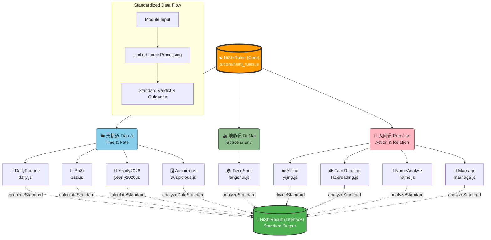

# 倪师统一逻辑架构图 (Ni Shi Unified Logic Architecture)

This diagram illustrates how the nine functional modules integrate with the core `NiShiRules` engine to produce a standardized `NiShiResult`.

## 数据流详解

1.  **Input (输入)**: 用户输入生辰、照片、姓名或其他参数。
2.  **Module Processing (模块处理)**: 各 `js/*.js` 模块执行具体的传统算法（如排盘、卦象生成）。
3.  **Standardization (标准化)**: 调用 `NiShiRules.createResult()` 将原生数据映射为统一格式。
4.  **Output (输出)**: 前端统一接收 `NiShiResult` 对象，包含：
    *   `source`: 来源（天/地/人）
    *   `pattern`: 象（视觉/现象）
    *   `calculation`: 数（能量/得分）
    *   `verdict`: 意（吉凶/结论）
    *   `guidance`: 道（行动建议）
